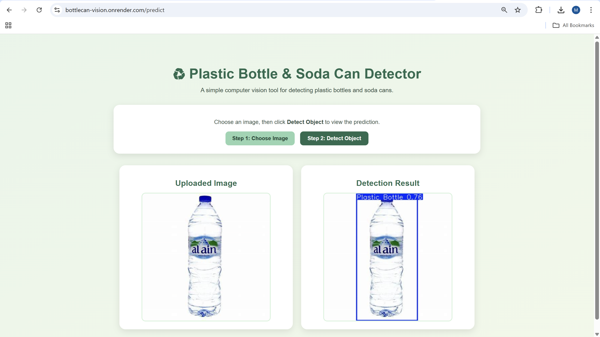

# Plastic Bottle & Soda Can Detector

A simple computer vision web application that detects whether an uploaded object is a **plastic bottle** or a **soda can** using a custom-trained **YOLOv8** object detection model.

## Project Overview

This project was developed as part of a **model deployment challenge**. The goal was to take a previously trained machine learning model and deploy it using **Flask** and **Docker**, then host it online so users could interact with it through a simple web interface.

The application allows users to upload an image, run object detection, and view both the uploaded image and the prediction result side by side.

## What the Model Does

The model was trained to detect two object classes:

- **Plastic Bottle**
- **Soda Can**

When a user uploads an image, the model analyzes it and returns a prediction that includes:

- A bounding box around the detected object
- The predicted class label
- The confidence score

## Technologies Used

- Python
- Flask
- YOLOv8 (Ultralytics)
- OpenCV
- HTML
- CSS
- Docker
- Render

## Project Structure

~~~text
Challenge-9-Model-Deployment/
├── app.py
├── requirements.txt
├── Dockerfile
├── model/
│   └── best.pt
├── templates/
│   └── index.html
├── static/
│   └── style.css
├── Sample Images/
├── assets/
│   └── app_preview.png
└── README.md
~~~

## How to Run the Project Locally with Docker

### 1. Clone the repository

~~~bash
git clone https://github.com/Maitha-Rashed/Challenge-9-Model-Deployment.git
cd Challenge-9-Model-Deployment
~~~

### 2. Build the Docker image

~~~bash
docker build -t bottlecan-vision .
~~~

### 3. Run the Docker container

~~~bash
docker run -p 5000:5000 bottlecan-vision
~~~

### 4. Open the application

Open your browser and go to:

~~~text
http://127.0.0.1:5000
~~~

## How to Use the Interface

1. Click **Step 1: Choose Image**
2. Select an image containing a plastic bottle or soda can
3. Click **Step 2: Detect Object**
4. Wait for the prediction result to appear
5. View both:
   - the uploaded image
   - the detection result image

## Live Deployment

The deployed application is available at:

**https://bottlecan-vision.onrender.com**

## Test Images

A `Sample Images` folder is included in the project to provide example images that can be used to test the application.

## Known Issues / Limitations

- The free Render instance may take time to wake up after inactivity
- Prediction can be slower on the deployed version because it runs on CPU
- The model is limited to only two object classes:
  - plastic bottle
  - soda can
- Detection accuracy may decrease if the uploaded image has poor lighting, unusual angles, or cluttered backgrounds
- On the free hosted version, the first request after inactivity may be delayed because the service needs to restart

## App Preview
Example:

## Notes

This repository was created for a machine learning deployment challenge where the objective was to deploy a previously trained object detection model using Flask and Docker, then host it online with a minimal but functional user interface.
